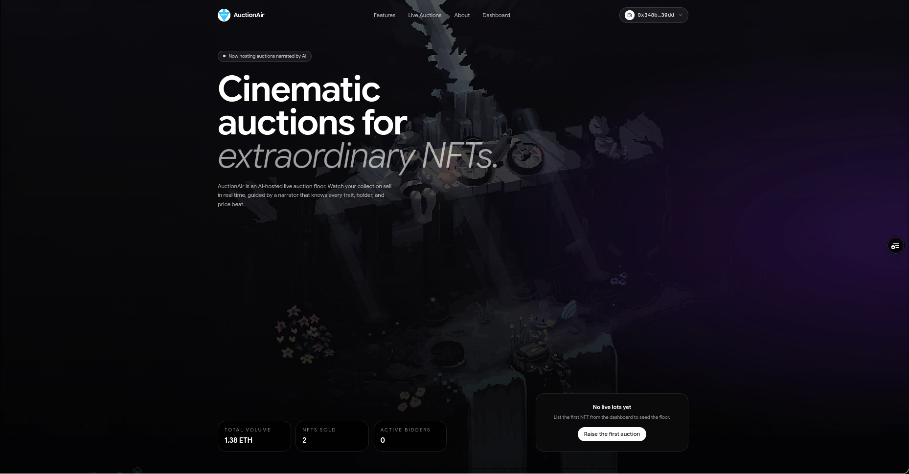
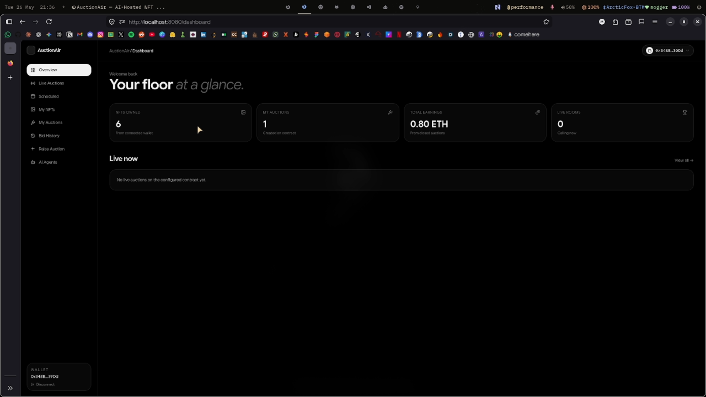
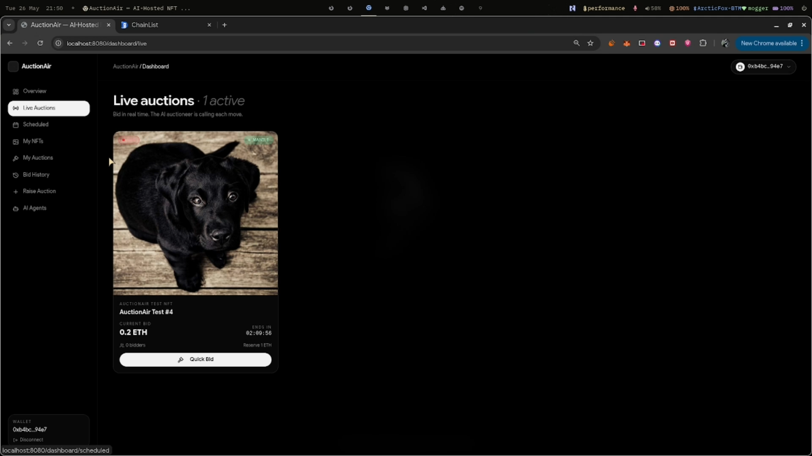
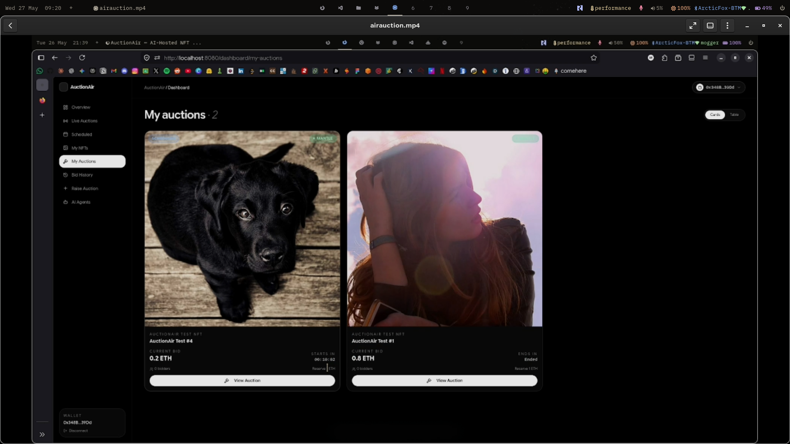
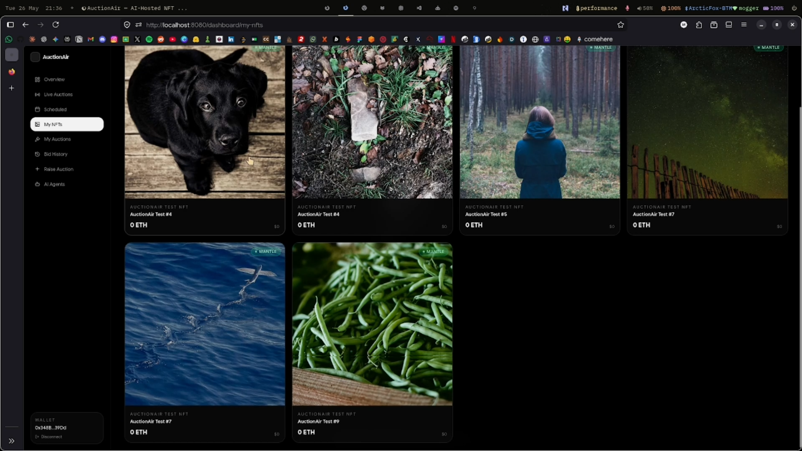
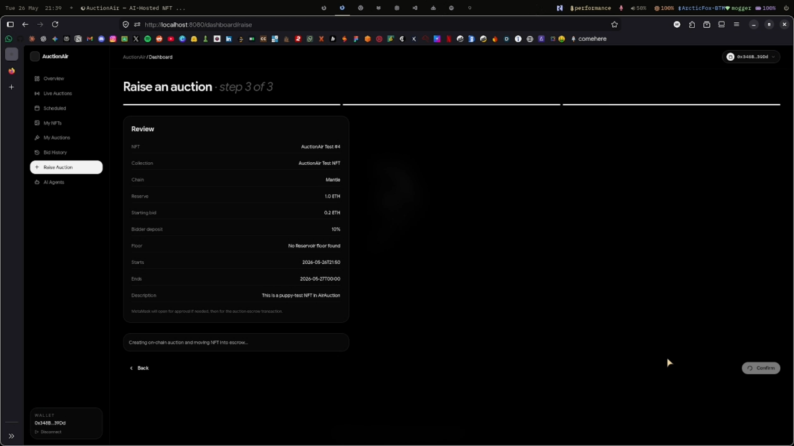
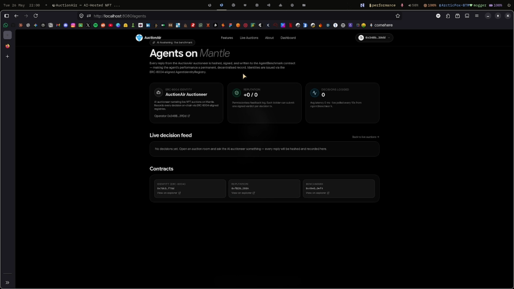
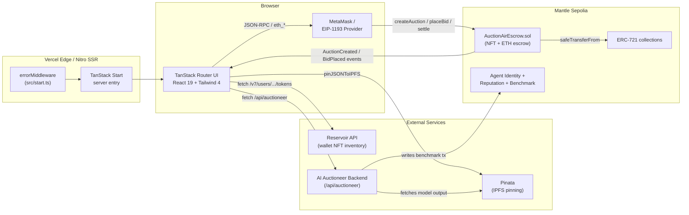
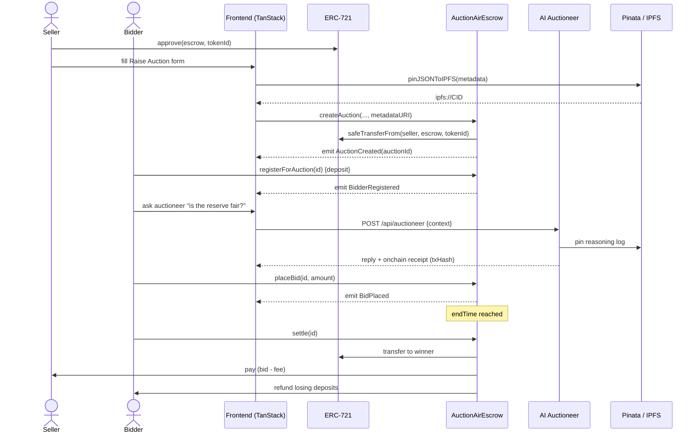
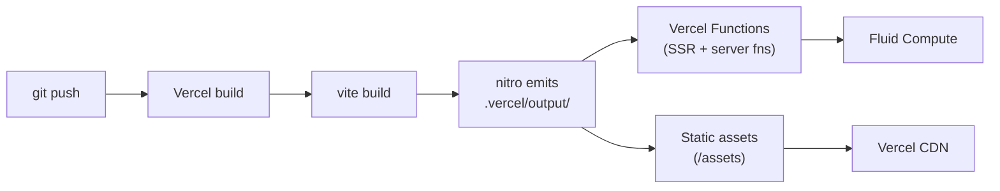

<div align="center">


<br />

<a href="#overview">
  
</a>

<br /><br />

<p>
  
  
  
  
</p>
<p>
  
  
  
  
</p>

<p>
  
  
  
  
</p>


</div>

<br />

<div align="center">
  <h3>
    <a href="#overview">Overview</a>
    <span>&nbsp;&middot;&nbsp;</span>
    <a href="#screenshots">Screenshots</a>
    <span>&nbsp;&middot;&nbsp;</span>
    <a href="#architecture">Architecture</a>
    <span>&nbsp;&middot;&nbsp;</span>
    <a href="#tech-stack">Stack</a>
    <span>&nbsp;&middot;&nbsp;</span>
    <a href="#setup">Setup</a>
    <span>&nbsp;&middot;&nbsp;</span>
    <a href="#deployment">Deploy</a>
  </h3>
</div>

<br />

## Table of Contents

<table>
<tr><td>

1. [Overview](#overview)
2. [Screenshots](#screenshots)
3. [Architecture](#architecture)
4. [What Each Layer Does](#what-each-layer-does)
5. [Tech Stack](#tech-stack)
6. [Project Structure](#project-structure)
7. [Smart Contract](#smart-contract)

</td><td>

8. [AI Auctioneer](#ai-auctioneer)
9. [Setup](#setup)
10. [Environment Variables](#environment-variables)
11. [Scripts](#scripts)
12. [Deployment](#deployment)
13. [Team](#team)
14. [License](#license)

</td></tr>
</table>


## Overview

> **AirAuction** is an end-to-end English-auction marketplace for ERC-721 NFTs. Sellers escrow their NFT into a Solidity contract; bidders register with a refundable deposit and place bids on-chain; an AI Auctioneer narrates the lot, answers bidder questions, and writes a signed log of its reasoning to IPFS and an on-chain agent registry so every recommendation is auditable.

<table>
<thead>
<tr>
<th width="30%">Capability</th>
<th>How it works</th>
</tr>
</thead>
<tbody>
<tr>
<td><strong>Trust-minimised escrow</strong></td>
<td>NFT custody and ETH deposits live inside <a href="blockchain/contracts/AuctionAirEscrow.sol"><code>AuctionAirEscrow.sol</code></a> — no custodial backend.</td>
</tr>
<tr>
<td><strong>Reserve + deposit model</strong></td>
<td>Sellers set a reserve price; bidders post a <code>depositBps</code> fraction of the starting bid to register, preventing wash bids.</td>
</tr>
<tr>
<td><strong>Atomic settlement</strong></td>
<td>A single <code>settle()</code> call transfers the NFT, pays the seller, deducts platform fees, and refunds losing deposits.</td>
</tr>
<tr>
<td><strong>AI-narrated lots</strong></td>
<td>The auctioneer agent generates lot copy and Q&amp;A; a hash of its input and output is stored on-chain via the agent benchmark contract.</td>
</tr>
<tr>
<td><strong>IPFS audit trail</strong></td>
<td>Each auction's metadata and agent transcript is pinned to IPFS through Pinata, returning an <code>ipfs://</code> CID referenced by both the contract and the UI.</td>
</tr>
<tr>
<td><strong>SSR-rendered frontend</strong></td>
<td>TanStack Start + Nitro deploys to Vercel as a hybrid SSR/edge app.</td>
</tr>
</tbody>
</table>


## Screenshots

<div align="center">

| Landing | Dashboard | Live Auctions |
| :---: | :---: | :---: |
| <a href="src/routes/index.tsx"></a> | <a href="src/routes/dashboard/index.tsx"></a> | <a href="src/routes/dashboard/live.tsx"></a> |
| Hero, live auction strip, volume + bidder stats | Personalised home — your auctions, watchlist, bid activity | Countdown, highest bid, one-click bidding |

| Scheduled | My NFTs | Raise Auction |
| :---: | :---: | :---: |
| <a href="src/routes/dashboard/scheduled.tsx"></a> | <a href="src/routes/dashboard/my-nfts.tsx"></a> | <a href="src/routes/dashboard/raise.tsx"></a> |
| Upcoming lots, register-ahead deposit flow | NFTs in your wallet via Reservoir — pick one to auction | Multi-step lot creation, approve + escrow in two tx |

<table>
<tr>
<td align="center" colspan="3">
<a href="src/routes/agents.tsx"></a>
<br /><br />
<strong>AI Auctioneer</strong> — chat with on-chain receipt of the model call (input hash, output hash, tx hash on the benchmark contract).
</td>
</tr>
</table>

</div>


## Architecture



<details>
<summary><strong>Bid lifecycle sequence</strong> — click to expand</summary>

<br />



</details>


## What Each Layer Does

| Layer | Folder / File | Responsibility |
| --- | --- | --- |
| **UI shell** | [`src/components/`](src/components/) | Reusable shadcn-style primitives: [`Navbar.tsx`](src/components/Navbar.tsx), [`AuctionCard.tsx`](src/components/AuctionCard.tsx), [`WalletButton.tsx`](src/components/WalletButton.tsx), [`ChatBubble.tsx`](src/components/ChatBubble.tsx). |
| **Routing** | [`src/routes/`](src/routes/) | File-based routes for landing, dashboard, single-auction view, and AI agent page. Tree generated into [`src/routeTree.gen.ts`](src/routeTree.gen.ts). |
| **State / hooks** | [`src/hooks/`](src/hooks/) | [`useAuctions.ts`](src/hooks/useAuctions.ts) loads escrow state, [`useCountdown.ts`](src/hooks/useCountdown.ts) ticks lot timers. |
| **Chain access** | [`src/services/auctionContract.ts`](src/services/auctionContract.ts) | Ethers v6 wrappers around the escrow contract: read auctions, place bids, settle, approve. |
| **NFT inventory** | [`src/services/nftApi.ts`](src/services/nftApi.ts) | Reservoir API client — fetches the connected wallet's NFTs for the *Raise Auction* picker. |
| **IPFS** | [`src/services/ipfs.ts`](src/services/ipfs.ts) | Pins auction + agent JSON via Pinata, returns `ipfs://CID`. |
| **AI** | [`src/services/aiAuctioneer.ts`](src/services/aiAuctioneer.ts) + [`src/services/agentRegistry.ts`](src/services/agentRegistry.ts) | Talks to the auctioneer backend, fetches on-chain agent identity / reputation. |
| **Config** | [`src/config/`](src/config/) | Env var schema ([`env.ts`](src/config/env.ts)) and supported chains. |
| **SSR entry** | [`src/start.ts`](src/start.ts) | TanStack Start instance with an `errorMiddleware` that catches non-HTTP throws and renders a branded error page. |
| **Router entry** | [`src/router.tsx`](src/router.tsx) | Builds the `Router` with a shared `QueryClient`. |
| **Smart contract** | [`blockchain/contracts/AuctionAirEscrow.sol`](blockchain/contracts/AuctionAirEscrow.sol) | The escrow, bid book, settlement, and refund logic. |
| **Deploy scripts** | [`blockchain/ignition/`](blockchain/ignition/), [`blockchain/scripts/`](blockchain/scripts/) | Hardhat Ignition module + helper scripts for Mantle Sepolia. |


## Tech Stack

<table>
<tr>
<td valign="top" width="50%">

#### Frontend

<p>


</p>

</td>
<td valign="top" width="50%">

#### Web3 & Chain

<p>


</p>

</td>
</tr>
<tr>
<td valign="top" width="50%">

#### AI & Storage

<p>


</p>

</td>
<td valign="top" width="50%">

#### Tooling & Hosting

<p>


</p>

</td>
</tr>
</table>


## Project Structure

```text
AirAuction/
├── assets/                          # README screenshots (img1.png … img7.png)
├── blockchain/
│   ├── contracts/
│   │   └── AuctionAirEscrow.sol     # Core auction escrow
│   ├── ignition/modules/
│   │   └── AuctionAirEscrow.ts      # Hardhat Ignition deploy module
│   └── scripts/                     # Deploy / mint / agent registration helpers
├── Agent/                           # AI auctioneer backend (separate service)
├── src/
│   ├── components/                  # UI primitives + feature components
│   ├── config/
│   │   ├── env.ts                   # VITE_* env loader
│   │   └── chains.ts                # Supported chains + RPC config
│   ├── hooks/                       # useAuctions, useCountdown, use-mobile
│   ├── lib/                         # utils, format, error-page, error-capture
│   ├── routes/
│   │   ├── index.tsx                # Landing
│   │   ├── dashboard.tsx            # Dashboard shell + sidebar
│   │   ├── dashboard/
│   │   │   ├── index.tsx            # Dashboard home
│   │   │   ├── live.tsx             # Live auctions
│   │   │   ├── scheduled.tsx        # Scheduled auctions
│   │   │   ├── my-auctions.tsx      # Auctions I created
│   │   │   ├── my-nfts.tsx          # NFTs in my wallet
│   │   │   ├── bids.tsx             # My bid history
│   │   │   └── raise.tsx            # Create new auction
│   │   ├── agents.tsx               # AI Auctioneer chat
│   │   └── auction/$id.tsx          # Single auction detail
│   ├── services/                    # Contract / IPFS / NFT / AI clients
│   ├── types/                       # Shared TypeScript types
│   ├── router.tsx                   # TanStack Router setup
│   └── start.ts                     # TanStack Start instance + middleware
├── package.json
├── tsconfig.json
└── vite.config.ts                   # tanstackStart + nitro + tailwind + viteReact
```


## Smart Contract

[`AuctionAirEscrow.sol`](blockchain/contracts/AuctionAirEscrow.sol) is a single-file, non-upgradeable escrow contract.

<table>
<thead>
<tr><th>Function</th><th>Caller</th><th>Effect</th></tr>
</thead>
<tbody>
<tr><td><code>createAuction(...)</code></td><td>Seller</td><td>Transfers NFT into escrow, records reserve / starting / deposit / window, emits <code>AuctionCreated</code>.</td></tr>
<tr><td><code>registerForAuction(id)</code></td><td>Bidder</td><td>Posts a refundable ETH deposit (<code>startingBid * depositBps / 10_000</code>). Required before bidding.</td></tr>
<tr><td><code>placeBid(id, amount)</code></td><td>Registered bidder</td><td>Updates <code>highestBid</code> / <code>highestBidder</code>. Previous high bid is credited back to that bidder's withdrawable balance.</td></tr>
<tr><td><code>settle(id)</code></td><td>Anyone, after <code>endTime</code></td><td>If reserve met: transfers NFT to winner, pays seller (minus <code>platformFeeBps</code>), refunds losing deposits. Otherwise: returns NFT to seller.</td></tr>
<tr><td><code>withdrawRefund(id)</code></td><td>Outbid / unregistered bidder</td><td>Pulls back any owed ETH (pull-payments).</td></tr>
<tr><td><code>cancelUnstartedAuction(id)</code></td><td>Seller, before <code>startTime</code></td><td>Returns NFT, refunds any early deposits.</td></tr>
<tr><td><code>setFee(recipient, bps)</code></td><td>Owner</td><td>Updates platform fee (capped at 10%).</td></tr>
</tbody>
</table>

<details>
<summary><strong>Safety properties</strong> — click to expand</summary>

<br />

| Property | Implementation |
| --- | --- |
| **Re-entrancy** | Custom `nonReentrant` modifier on all state-changing entry points. |
| **NFT custody** | Implements `IERC721Receiver.onERC721Received` so it can receive via `safeTransferFrom`. |
| **Pull payments** | Losing bidders withdraw via `withdrawRefund` instead of being pushed ETH on every bid update — prevents griefing. |
| **Fee cap** | `MAX_PLATFORM_FEE_BPS = 1_000` (10%) and `MAX_DEPOSIT_BPS = 5_000` (50%) hard-coded. |
| **Self-bid block** | `placeBid` rejects the seller's address. |

</details>


## AI Auctioneer

The auctioneer is a separate Node service (under [`Agent/`](Agent/)) consumed by the frontend through `VITE_AGENT_API_URL`. Each call is **on-chain verifiable**:

```ts
askAuctioneer(context, userMessage)
   → POST {agentApiUrl}/api/auctioneer
   → returns { reply, model, latencyMs, agentId, onchain: { txHash, inputHash, outputHash, ... } }
```

| Concept | Where | Why |
| --- | --- | --- |
| **Agent identity** | `VITE_AGENT_IDENTITY_ADDRESS` | NFT-style identity contract — each agent has an `agentId` minted on-chain. |
| **Agent reputation** | `VITE_AGENT_REPUTATION_ADDRESS` | Scoring contract that aggregates user feedback on past calls. |
| **Agent benchmark** | `VITE_AGENT_BENCHMARK_ADDRESS` | Each model call writes `keccak256(input)` and `keccak256(output)` — anyone can replay the prompt and verify the hash. |

The frontend renders the `onchain` receipt in [`src/routes/agents.tsx`](src/routes/agents.tsx) as a small *View on explorer* link next to the reply.


## Setup

### Prerequisites

- **Node.js 20+**
- **Package manager** — npm / bun / pnpm (this repo includes both `package-lock.json` and `bun.lock`)
- **MetaMask wallet** funded with Mantle Sepolia ETH ([faucet](https://faucet.sepolia.mantle.xyz))
- **API keys** — Pinata (IPFS), Reservoir (NFT inventory)

### 1. Install

```bash
npm install
```

### 2. Configure env

Copy the template and fill in your values:

```bash
cp .env.example .env.local   # if .env.example exists; otherwise create .env.local
```

See [Environment Variables](#environment-variables) below.

### 3. Compile + deploy contracts (optional — only if you want your own deployment)

```bash
cd blockchain
npm install
npm run compile
npm run deploy:mantle-sepolia:ignition
npm run deploy:agents:mantle-sepolia   # identity + reputation + benchmark
```

Copy the deployed addresses back into `.env.local` as `VITE_AUCTION_ESCROW_ADDRESS` and the three `VITE_AGENT_*_ADDRESS` vars.

### 4. Run

```bash
npm run dev      # http://localhost:3000
npm run build    # production build → .vercel/output/
npm run preview  # preview the production build locally
```


## Environment Variables

All public env vars are prefixed `VITE_` so they're inlined by Vite at build time. The schema lives in [`src/config/env.ts`](src/config/env.ts).

<details open>
<summary><strong>Required & optional variables</strong></summary>

<br />

| Variable | Required | Purpose |
| --- | :---: | --- |
| `VITE_AUCTION_ESCROW_ADDRESS` | **yes** | Deployed `AuctionAirEscrow` address on Mantle Sepolia. |
| `VITE_PUBLIC_RPC_URL` | optional | Fallback RPC when wallet isn't connected. Defaults to the chain config. |
| `VITE_PINATA_JWT` | **yes** *(raising)* | Pinata API JWT for IPFS pinning. |
| `VITE_RESERVOIR_API_KEY` | **yes** *(My NFTs)* | Reservoir API key. |
| `VITE_RESERVOIR_BASE_URL` | optional | Override default Reservoir endpoint. |
| `VITE_NFT_CONTRACTS` | optional | Comma-separated allow-list of NFT contract addresses. |
| `VITE_AGENT_API_URL` | **yes** *(AI tab)* | URL of the Auctioneer backend. Defaults to `http://localhost:5050`. |
| `VITE_AGENT_IDENTITY_ADDRESS` | optional | Agent identity contract address. |
| `VITE_AGENT_REPUTATION_ADDRESS` | optional | Agent reputation contract address. |
| `VITE_AGENT_BENCHMARK_ADDRESS` | optional | Agent benchmark contract address. |
| `VITE_AGENT_ID` | optional | Numeric ID of the auctioneer agent to display. |

</details>


## Scripts

<table>
<tr>
<td valign="top" width="50%">

#### Frontend ([`package.json`](package.json))

| Script | What it does |
| --- | --- |
| `npm run dev` | Vite dev server with HMR. |
| `npm run build` | Production build through Nitro. |
| `npm run build:dev` | Build with source maps, no minification. |
| `npm run preview` | Serve the production build locally. |
| `npm run lint` | ESLint over the repo. |
| `npm run format` | Prettier write-mode. |

</td>
<td valign="top" width="50%">

#### Blockchain ([`blockchain/package.json`](blockchain/package.json))

| Script | What it does |
| --- | --- |
| `npm run compile` | `hardhat compile` — builds all contracts. |
| `npm run deploy:mantle-sepolia` | Runs the legacy deploy script. |
| `npm run deploy:mantle-sepolia:ignition` | Deploys via Hardhat Ignition (recommended). |
| `npm run mint:mantle-sepolia` | Mints a test NFT for trying the auction flow. |
| `npm run deploy:agents:mantle-sepolia` | Deploys identity + reputation + benchmark. |

</td>
</tr>
</table>


## Deployment

This repo is configured for **Vercel** via the Nitro Vite plugin.



> **Vercel project settings** — leave Framework Preset on auto-detect, leave Output Directory blank. Nitro writes the `.vercel/output/` build manifest Vercel reads natively.
>
> **Do not** add a `vercel.json` with `rewrites` to `/index.html` — there is no `index.html` in an SSR build, and that rewrite returns 404 for every URL.

Required env vars in the Vercel dashboard: copy the same `VITE_*` variables from your `.env.local` into **Project Settings → Environment Variables**.


## Team

<div align="center">

<table>
<tr>
<td align="center" width="25%">
<strong>Prieyan MN</strong>
<br /><sub>Engineering</sub>
</td>
<td align="center" width="25%">
<strong>Sanjay E</strong>
<br /><sub>Engineering</sub>
</td>
<td align="center" width="25%">
<strong>MadhanRaj M</strong>
<br /><sub>Engineering</sub>
</td>
<td align="center" width="25%">
<strong>Lakshanika RSM</strong>
<br /><sub>Engineering</sub>
</td>
</tr>
</table>

</div>


## License

Released under the **MIT License**. See [`LICENSE`](LICENSE) for details.

<br />

<div align="center">


<sub>Crafted with care for the Mantle ecosystem &nbsp;&middot;&nbsp; <a href="#">Back to top</a></sub>

</div>