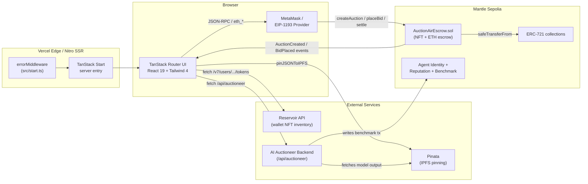
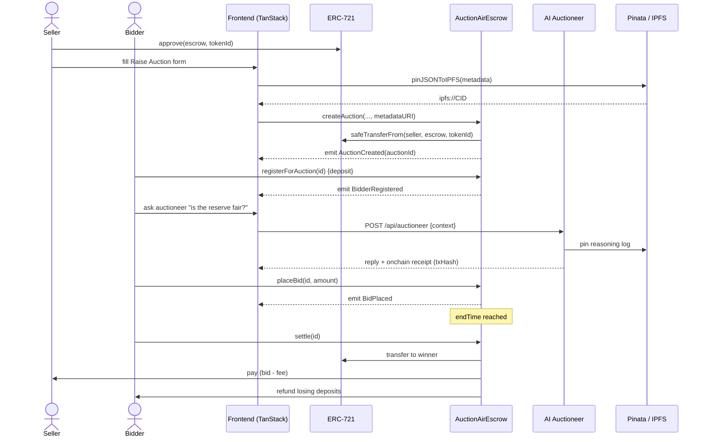
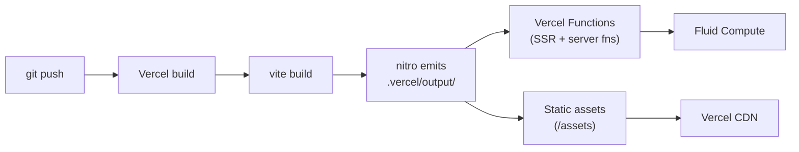

<div align="center">

# AirAuction

**A fully on-chain NFT auction protocol with an AI Auctioneer agent, IPFS-anchored audit trails, and verifiable agent reputation — all in one React + TanStack Start app.**


</div>

---

## Table of Contents

1. [Overview](#overview)
2. [Screenshots](#screenshots)
3. [Architecture](#architecture)
4. [What Each Layer Does](#what-each-layer-does)
5. [Tech Stack](#tech-stack)
6. [Project Structure](#project-structure)
7. [Smart Contract](#smart-contract)
8. [AI Auctioneer](#ai-auctioneer)
9. [Setup](#setup)
10. [Environment Variables](#environment-variables)
11. [Scripts](#scripts)
12. [Deployment](#deployment)
13. [License](#license)

---

## Overview

AirAuction is an end-to-end English-auction marketplace for ERC-721 NFTs. Sellers escrow their NFT into a Solidity contract; bidders register with a refundable deposit and place bids on-chain; an AI Auctioneer narrates the lot, answers bidder questions, and writes a signed log of its reasoning to IPFS + an on-chain agent registry so every recommendation is auditable.

| Capability | How it works |
| --- | --- |
| **Trust-minimised escrow** | NFT custody and ETH deposits live inside [`AuctionAirEscrow.sol`](blockchain/contracts/AuctionAirEscrow.sol) — no custodial backend. |
| **Reserve + deposit model** | Sellers set a reserve price; bidders post a `depositBps` fraction of the starting bid to register, preventing wash bids. |
| **Atomic settlement** | A single `settle()` call transfers the NFT, pays the seller, deducts platform fees, and refunds losing deposits. |
| **AI-narrated lots** | The auctioneer agent generates lot copy and Q&A; a hash of its input + output is stored on-chain via the agent benchmark contract. |
| **IPFS audit trail** | Each auction's metadata + agent transcript is pinned to IPFS through Pinata, returning a `ipfs://` CID referenced by both the contract and the UI. |
| **SSR-rendered frontend** | TanStack Start + Nitro deploys to Vercel as a hybrid SSR/edge app. |

---

## Screenshots

> Drop your images in the [`assets/`](assets/) folder using the filenames below — they render automatically.

| Screen | Preview | Description |
| --- | --- | --- |
| **Landing page** |  | Hero, live auction strip, ended volume + unique bidders stats. Route: [`src/routes/index.tsx`](src/routes/index.tsx). |
| **Dashboard** |  | Personalised home — your auctions, watchlist, bid activity. Route: [`src/routes/dashboard/index.tsx`](src/routes/dashboard/index.tsx). |
| **Live auctions** |  | Currently-running lots with countdown, current highest bid, and one-click bid. Route: [`src/routes/dashboard/live.tsx`](src/routes/dashboard/live.tsx). |
| **Scheduled auctions** |  | Upcoming lots, register-ahead deposit flow. Route: [`src/routes/dashboard/scheduled.tsx`](src/routes/dashboard/scheduled.tsx). |
| **My NFTs** |  | NFTs in your connected wallet (via Reservoir API) — pick one to auction. Route: [`src/routes/dashboard/my-nfts.tsx`](src/routes/dashboard/my-nfts.tsx). |
| **Raise auction** |  | Multi-step form: pick NFT, set reserve / starting bid / window / deposit bps, approve + escrow in two transactions. Route: [`src/routes/dashboard/raise.tsx`](src/routes/dashboard/raise.tsx). |
| **AI Agent** |  | Auctioneer chat with on-chain receipt of the model call (input hash, output hash, tx hash on the benchmark contract). Route: [`src/routes/agents.tsx`](src/routes/agents.tsx). |

---

## Architecture



### Bid lifecycle sequence



---

## What Each Layer Does

| Layer | Folder / File | Responsibility |
| --- | --- | --- |
| **UI shell** | [`src/components/`](src/components/) | Reusable shadcn-style primitives: [`Navbar.tsx`](src/components/Navbar.tsx), [`AuctionCard.tsx`](src/components/AuctionCard.tsx), [`WalletButton.tsx`](src/components/WalletButton.tsx), [`ChatBubble.tsx`](src/components/ChatBubble.tsx). |
| **Routing** | [`src/routes/`](src/routes/) | File-based routes for landing, dashboard, single-auction view, and AI agent page. Tree generated into [`src/routeTree.gen.ts`](src/routeTree.gen.ts). |
| **State / hooks** | [`src/hooks/`](src/hooks/) | [`useAuctions.ts`](src/hooks/useAuctions.ts) loads escrow state, [`useCountdown.ts`](src/hooks/useCountdown.ts) ticks lot timers. |
| **Chain access** | [`src/services/auctionContract.ts`](src/services/auctionContract.ts) | Ethers v6 wrappers around the escrow contract: read auctions, place bids, settle, approve. |
| **NFT inventory** | [`src/services/nftApi.ts`](src/services/nftApi.ts) | Reservoir API client — fetches the connected wallet's NFTs for the *Raise Auction* picker. |
| **IPFS** | [`src/services/ipfs.ts`](src/services/ipfs.ts) | Pins auction + agent JSON via Pinata, returns `ipfs://CID`. |
| **AI** | [`src/services/aiAuctioneer.ts`](src/services/aiAuctioneer.ts) + [`src/services/agentRegistry.ts`](src/services/agentRegistry.ts) | Talks to the auctioneer backend, fetches on-chain agent identity / reputation. |
| **Config** | [`src/config/`](src/config/) | Env var schema ([`env.ts`](src/config/env.ts)) and supported chains. |
| **SSR entry** | [`src/start.ts`](src/start.ts) | TanStack Start instance with an `errorMiddleware` that catches non-HTTP throws and renders a branded error page. |
| **Router entry** | [`src/router.tsx`](src/router.tsx) | Builds the `Router` with a shared `QueryClient`. |
| **Smart contract** | [`blockchain/contracts/AuctionAirEscrow.sol`](blockchain/contracts/AuctionAirEscrow.sol) | The escrow, bid book, settlement, and refund logic. |
| **Deploy scripts** | [`blockchain/ignition/`](blockchain/ignition/), [`blockchain/scripts/`](blockchain/scripts/) | Hardhat Ignition module + helper scripts for Mantle Sepolia. |

---

## Tech Stack

| Domain | Tooling |
| --- | --- |
| **Framework** | TanStack Start (SSR), TanStack Router, TanStack Query |
| **UI** | React 19, Tailwind CSS 4, shadcn/ui primitives (Radix), lucide-react icons, sonner toasts |
| **Forms** | react-hook-form + zod resolvers |
| **Web3** | ethers v6, MetaMask / EIP-1193 |
| **Chain** | Mantle Sepolia testnet (chainId 5003), Solidity 0.8.28, Hardhat 3 + Ignition |
| **AI** | External Auctioneer service (Node) consumed via `VITE_AGENT_API_URL` |
| **Storage** | IPFS via Pinata pinning service |
| **NFT data** | Reservoir API |
| **Build** | Vite 7, Nitro (Vercel preset), `vite-tsconfig-paths`, `@tailwindcss/vite` |
| **Lint / format** | ESLint 9, Prettier 3, TypeScript 5.8 |
| **Hosting** | Vercel (frontend + Nitro serverless), Mantle Sepolia (contracts), Pinata (IPFS) |

---

## Project Structure

```
AirAuction/
├── assets/                          # README screenshots (img1.png … img7.png)
├── blockchain/
│   ├── contracts/
│   │   └── AuctionAirEscrow.sol     # Core auction escrow
│   ├── ignition/modules/
│   │   └── AuctionAirEscrow.ts      # Hardhat Ignition deploy module
│   └── scripts/                     # Deploy / mint / agent registration helpers
├── Agent/                           # AI auctioneer backend (separate service)
├── src/
│   ├── components/                  # UI primitives + feature components
│   ├── config/
│   │   ├── env.ts                   # VITE_* env loader
│   │   └── chains.ts                # Supported chains + RPC config
│   ├── hooks/                       # useAuctions, useCountdown, use-mobile
│   ├── lib/                         # utils, format, error-page, error-capture
│   ├── routes/
│   │   ├── index.tsx                # Landing
│   │   ├── dashboard.tsx            # Dashboard shell + sidebar
│   │   ├── dashboard/
│   │   │   ├── index.tsx            # Dashboard home
│   │   │   ├── live.tsx             # Live auctions
│   │   │   ├── scheduled.tsx        # Scheduled auctions
│   │   │   ├── my-auctions.tsx      # Auctions I created
│   │   │   ├── my-nfts.tsx          # NFTs in my wallet
│   │   │   ├── bids.tsx             # My bid history
│   │   │   └── raise.tsx            # Create new auction
│   │   ├── agents.tsx               # AI Auctioneer chat
│   │   └── auction/$id.tsx          # Single auction detail
│   ├── services/                    # Contract / IPFS / NFT / AI clients
│   ├── types/                       # Shared TypeScript types
│   ├── router.tsx                   # TanStack Router setup
│   └── start.ts                     # TanStack Start instance + middleware
├── package.json
├── tsconfig.json
└── vite.config.ts                   # tanstackStart + nitro + tailwind + viteReact
```

---

## Smart Contract

[`AuctionAirEscrow.sol`](blockchain/contracts/AuctionAirEscrow.sol) is a single-file, non-upgradeable escrow contract.

| Function | Caller | Effect |
| --- | --- | --- |
| `createAuction(...)` | Seller | Transfers NFT into escrow, records reserve / starting / deposit / window, emits `AuctionCreated`. |
| `registerForAuction(id)` | Bidder | Posts a refundable ETH deposit (`startingBid * depositBps / 10_000`). Required before bidding. |
| `placeBid(id, amount)` | Registered bidder | Updates `highestBid` / `highestBidder`. Previous high bid is credited back to that bidder's withdrawable balance. |
| `settle(id)` | Anyone, after `endTime` | If reserve met: transfers NFT to winner, pays seller (minus `platformFeeBps`), refunds losing deposits. Otherwise: returns NFT to seller. |
| `withdrawRefund(id)` | Outbid / unregistered bidder | Pulls back any owed ETH (pull-payments). |
| `cancelUnstartedAuction(id)` | Seller, before `startTime` | Returns NFT, refunds any early deposits. |
| `setFee(recipient, bps)` | Owner | Updates platform fee (capped at 10%). |

**Safety properties**

| Property | Implementation |
| --- | --- |
| **Re-entrancy** | Custom `nonReentrant` modifier on all state-changing entry points. |
| **NFT custody** | Implements `IERC721Receiver.onERC721Received` so it can receive via `safeTransferFrom`. |
| **Pull payments** | Losing bidders withdraw via `withdrawRefund` instead of being pushed ETH on every bid update — prevents griefing. |
| **Fee cap** | `MAX_PLATFORM_FEE_BPS = 1_000` (10%) and `MAX_DEPOSIT_BPS = 5_000` (50%) hard-coded. |
| **Self-bid block** | `placeBid` rejects the seller's address. |

---

## AI Auctioneer

The auctioneer is a separate Node service (under [`Agent/`](Agent/)) consumed by the frontend through `VITE_AGENT_API_URL`. Each call is **on-chain verifiable**:

```
askAuctioneer(context, userMessage)
   → POST {agentApiUrl}/api/auctioneer
   → returns { reply, model, latencyMs, agentId, onchain: { txHash, inputHash, outputHash, ... } }
```

| Concept | Where | Why |
| --- | --- | --- |
| **Agent identity** | `VITE_AGENT_IDENTITY_ADDRESS` | NFT-style identity contract — each agent has an `agentId` minted on-chain. |
| **Agent reputation** | `VITE_AGENT_REPUTATION_ADDRESS` | Scoring contract that aggregates user feedback on past calls. |
| **Agent benchmark** | `VITE_AGENT_BENCHMARK_ADDRESS` | Each model call writes `keccak256(input)` and `keccak256(output)` — anyone can replay the prompt and verify the hash. |

The frontend renders the `onchain` receipt in [`src/routes/agents.tsx`](src/routes/agents.tsx) as a small "View on explorer" link next to the reply.

---

## Setup

### Prerequisites

- Node.js 20+
- npm / bun / pnpm (this repo includes both `package-lock.json` and `bun.lock`)
- A MetaMask wallet funded with Mantle Sepolia ETH ([faucet](https://faucet.sepolia.mantle.xyz))
- API keys: Pinata (IPFS), Reservoir (NFT inventory)

### 1. Install

```bash
npm install
```

### 2. Configure env

Copy the template and fill in your values:

```bash
cp .env.example .env.local   # if .env.example exists; otherwise create .env.local
```

See [Environment Variables](#environment-variables) below.

### 3. Compile + deploy contracts (optional — only if you want your own deployment)

```bash
cd blockchain
npm install
npm run compile
npm run deploy:mantle-sepolia:ignition
npm run deploy:agents:mantle-sepolia   # identity + reputation + benchmark
```

Copy the deployed addresses back into `.env.local` as `VITE_AUCTION_ESCROW_ADDRESS` and the three `VITE_AGENT_*_ADDRESS` vars.

### 4. Run

```bash
npm run dev      # http://localhost:3000
npm run build    # production build → .vercel/output/
npm run preview  # preview the production build locally
```

---

## Environment Variables

All public env vars are prefixed `VITE_` so they're inlined by Vite at build time. The schema lives in [`src/config/env.ts`](src/config/env.ts).

| Variable | Required | Purpose |
| --- | --- | --- |
| `VITE_AUCTION_ESCROW_ADDRESS` | yes | Deployed `AuctionAirEscrow` address on Mantle Sepolia. |
| `VITE_PUBLIC_RPC_URL` | optional | Fallback RPC when wallet isn't connected. Defaults to the chain config. |
| `VITE_PINATA_JWT` | yes (for raising) | Pinata API JWT for IPFS pinning. |
| `VITE_RESERVOIR_API_KEY` | yes (for *My NFTs*) | Reservoir API key. |
| `VITE_RESERVOIR_BASE_URL` | optional | Override default Reservoir endpoint. |
| `VITE_NFT_CONTRACTS` | optional | Comma-separated allow-list of NFT contract addresses. |
| `VITE_AGENT_API_URL` | yes (for AI tab) | URL of the Auctioneer backend. Defaults to `http://localhost:5050`. |
| `VITE_AGENT_IDENTITY_ADDRESS` | optional | Agent identity contract address. |
| `VITE_AGENT_REPUTATION_ADDRESS` | optional | Agent reputation contract address. |
| `VITE_AGENT_BENCHMARK_ADDRESS` | optional | Agent benchmark contract address. |
| `VITE_AGENT_ID` | optional | Numeric ID of the auctioneer agent to display. |

---

## Scripts

### Frontend ([`package.json`](package.json))

| Script | What it does |
| --- | --- |
| `npm run dev` | Vite dev server with HMR. |
| `npm run build` | Production build through Nitro → `.vercel/output/`. |
| `npm run build:dev` | Build with `--mode development` (source maps, no minification). |
| `npm run preview` | Serve the production build locally. |
| `npm run lint` | ESLint over the repo. |
| `npm run format` | Prettier write-mode. |

### Blockchain ([`blockchain/package.json`](blockchain/package.json))

| Script | What it does |
| --- | --- |
| `npm run compile` | `hardhat compile` — builds all contracts. |
| `npm run deploy:mantle-sepolia` | Runs the legacy deploy script. |
| `npm run deploy:mantle-sepolia:ignition` | Deploys via Hardhat Ignition (recommended). |
| `npm run mint:mantle-sepolia` | Mints a test NFT for trying the auction flow. |
| `npm run deploy:agents:mantle-sepolia` | Deploys identity + reputation + benchmark contracts. |

---

## Deployment

This repo is configured for **Vercel** via the Nitro Vite plugin.



**Vercel project settings** — leave Framework Preset on auto-detect, leave Output Directory blank. Nitro writes the `.vercel/output/` build manifest Vercel reads natively. Do **not** add a `vercel.json` with `rewrites` to `/index.html` — there is no `index.html` in an SSR build, and that rewrite returns 404 for every URL.

Required env vars in the Vercel dashboard: copy the same `VITE_*` variables from your `.env.local` into Project Settings → Environment Variables.

---

## License

MIT — see contract SPDX header. Frontend code is unlicensed by default; add a `LICENSE` file if you intend to open-source it.
